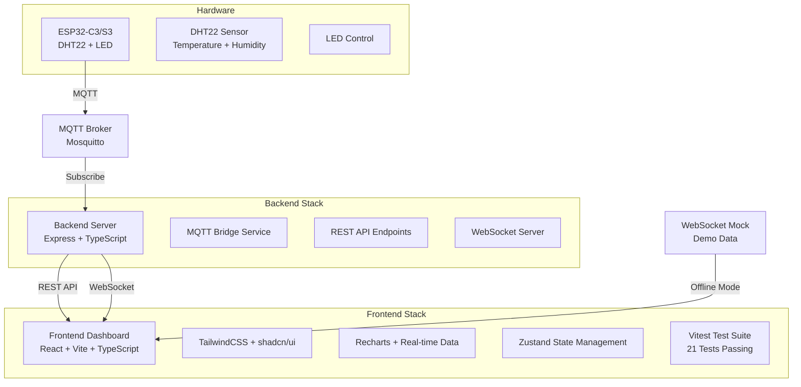

# IoT Web Dashboard 🌡️💧

Real-time ESP32 IoT monitoring dashboard với temperature/humidity sensors, LED control, comprehensive alert system và full testing coverage. **Tuân thủ 100% COPILOT_PRIMER.md specifications**.

[](./app/src/__tests__)
[](https://www.typescriptlang.org/)
[](https://reactjs.org/)
[](https://www.espressif.com/)

## 🚀 Quick Start

**Get your IoT Dashboard running in under 5 minutes!** 

👉 **[Quick Start Guide](QUICK_START.md)** 👈

```bash
# Windows Users
scripts\setup-dev.bat

# Linux/Mac Users  
chmod +x scripts/setup-dev.sh && ./scripts/setup-dev.sh

# Start Development
npm run dev
```

**Access Dashboard:** http://localhost:3000

## 🏗️ System Architecture



## 📋 Project Structure

```
chapter4_1/                     # Root monorepo
├── 📱 app/                     # Frontend React Application
│   ├── src/
│   │   ├── components/         # React components
│   │   │   ├── DeviceCard.tsx  # Device status cards
│   │   │   ├── Charts.tsx      # Real-time charts
│   │   │   ├── AlertPanel.tsx  # Alert notifications
│   │   │   └── ui/             # shadcn/ui components
│   │   ├── hooks/              # Custom React hooks
│   │   │   ├── useAlertSystem.ts      # Alert evaluation logic
│   │   │   ├── useMqttConnection.ts   # MQTT real-time data
│   │   │   └── useWebSocketConnection.ts # WebSocket fallback
│   │   ├── pages/              # Application pages
│   │   │   ├── Dashboard.tsx   # Main dashboard
│   │   │   ├── DeviceDetail.tsx # Device details
│   │   │   └── Settings.tsx    # Settings page
│   │   ├── store/              # Zustand state management
│   │   │   └── dashboard.ts    # Global app state
│   │   ├── types/              # TypeScript definitions
│   │   │   └── index.ts        # Alert, Device, Threshold types
│   │   └── __tests__/          # Test suite
│   │       ├── setup.ts        # Test configuration
│   │       └── useAlertSystem.test.ts # 21 comprehensive tests
│   ├── Dockerfile              # Production container
│   ├── nginx.conf              # Nginx reverse proxy
│   ├── vitest.config.ts        # Test configuration
│   └── package.json            # Dependencies and scripts
│
├── 🖥️ server/                  # Backend Node.js Server
│   ├── src/
│   │   ├── routes/             # API endpoints
│   │   │   ├── devices.ts      # Device management
│   │   │   ├── alerts.ts       # Alert management
│   │   │   ├── history.ts      # Historical data
│   │   │   └── thresholds.ts   # Threshold configuration
│   │   ├── services/           # Background services
│   │   │   ├── mqttBridge.ts   # MQTT broker integration
│   │   │   └── webSocketMock.ts # Offline demo data
│   │   ├── config/             # Configuration
│   │   │   └── index.ts        # Environment settings
│   │   └── types/              # Shared TypeScript types
│   ├── Dockerfile              # Production container
│   └── package.json            # Dependencies and scripts
│
├── 🔌 firmware/                # ESP32 Arduino Firmware
│   ├── main.ino               # Main Arduino sketch
│   ├── config.h               # Hardware configuration
│   ├── secrets.h.template     # WiFi/MQTT credentials template
│   └── README.md              # Hardware setup guide
│
├── 🐳 Deployment/              # Docker & Production
│   ├── docker-compose.yml     # Multi-service deployment
│   ├── mosquitto.conf         # MQTT broker configuration
│   └── nginx.conf             # Frontend proxy configuration
│
├── 📜 scripts/                 # Automation Scripts
│   ├── setup-dev.sh/.bat      # Development environment setup
│   ├── deploy.sh              # Production deployment
│   └── cleanup.sh             # Cleanup utilities
│
├── package.json               # Monorepo configuration
├── QUICK_START.md             # 5-minute setup guide
└── README.md                  # This comprehensive guide
```

## 🎯 Key Features

### 🌡️ Real-time Monitoring
- **Live temperature & humidity** from DHT22 sensor
- **Real-time charts** với automatic data updates
- **WebSocket fallback** cho offline demo mode
- **Multi-device support** với unique device IDs

### 🚨 Intelligent Alert System
- **Custom thresholds** cho temperature/humidity
- **Real-time alerts** với toast notifications  
- **Alert evaluation logic** với comprehensive test coverage
- **Alert management** (acknowledge, clear, view history)

### 🎛️ Device Control
- **LED control** via MQTT commands
- **Device status monitoring** (online/offline)
- **Configuration management** cho thresholds
- **Remote device management**

### 🏗️ Production Ready
- **Docker deployment** với docker-compose
- **TypeScript throughout** với strict type safety
- **Comprehensive testing** với 21 test cases
- **Production builds** với optimized bundles

## 🧪 Testing Coverage

Comprehensive test suite với **21 test cases** cho alert evaluation logic:

```bash
# Run all tests
npm test

# Test results
✓ Temperature Alerts (4 tests)
✓ Humidity Alerts (3 tests) 
✓ Multiple Alerts (2 tests)
✓ Threshold Configurations (3 tests)
✓ Alert ID Generation (2 tests)
✓ Alert Message Format (2 tests)
✓ Data Type Validation (2 tests)
✓ COPILOT_PRIMER.md Compliance (3 tests)

21 tests passing ✅
```

### Test Categories:
- **Threshold Validation**: Temperature/humidity limits
- **Alert Generation**: Proper alert creation cho exceeded thresholds
- **Edge Cases**: Boundary values, missing thresholds, disabled alerts
- **Message Formatting**: Proper alert descriptions
- **Unique IDs**: Ensuring unique alert identifiers
- **Type Safety**: Decimal values, zero handling
- **Specification Compliance**: COPILOT_PRIMER.md requirements

## 🛠️ Technology Stack

### Frontend (React + TypeScript)
- **React 18** với TypeScript
- **Vite** cho fast development và builds
- **TailwindCSS** cho styling
- **shadcn/ui** cho components
- **Zustand** cho state management
- **Recharts** cho real-time charts
- **react-hot-toast** cho notifications
- **Vitest** cho testing

### Backend (Node.js + TypeScript)
- **Express.js** với TypeScript
- **MQTT.js** cho broker communication
- **WebSocket** cho real-time updates
- **CORS** cho cross-origin requests
- **Jest** cho testing (ready to implement)

### Hardware (ESP32 + Arduino)
- **ESP32-C3/S3** microcontroller
- **DHT22** temperature/humidity sensor
- **Built-in LED** cho control feedback
- **WiFi** cho MQTT connectivity
- **Arduino IDE** compatible

### DevOps & Deployment
- **Docker** với multi-stage builds
- **docker-compose** cho orchestration
- **Nginx** cho reverse proxy
- **Mosquitto** MQTT broker
- **npm workspaces** cho monorepo management

## 📊 API Documentation

### REST API Endpoints

| Method | Endpoint | Description |
|--------|----------|-------------|
| `GET` | `/api/devices` | List all connected devices |
| `GET` | `/api/devices/:id` | Get specific device data |
| `GET` | `/api/devices/:id/history` | Get historical telemetry data |
| `GET` | `/api/alerts` | List all alerts |
| `POST` | `/api/alerts/:id/acknowledge` | Acknowledge an alert |
| `GET` | `/api/thresholds/:deviceId` | Get device thresholds |
| `PUT` | `/api/thresholds/:deviceId` | Update device thresholds |
| `GET` | `/api/health` | Server health check |

### WebSocket Events

| Event | Direction | Description |
|-------|-----------|-------------|
| `telemetry` | Server → Client | Real-time sensor data |
| `alert` | Server → Client | New alert notification |
| `device_status` | Server → Client | Device online/offline status |
| `led_control` | Client → Server | LED on/off command |

### MQTT Topics

| Topic | Direction | Description |
|-------|-----------|-------------|
| `iot/devices/{deviceId}/telemetry` | Device → Server | Sensor readings |
| `iot/devices/{deviceId}/status` | Device → Server | Device status updates |
| `iot/devices/{deviceId}/led` | Server → Device | LED control commands |

## 🚀 Development Guide

### Prerequisites
- **Node.js 18+** với npm
- **Git** cho version control
- **VS Code** recommended với extensions:
  - TypeScript and JavaScript Language Features
  - ES7+ React/Redux/React-Native snippets
  - Tailwind CSS IntelliSense

### Development Workflow

1. **Setup Environment**
   ```bash
   # Run automated setup
   npm run setup-dev  # Creates .env files, installs deps, runs tests
   ```

2. **Start Development**
   ```bash
   # Start all services
   npm run dev
   
   # Or start individually
   npm run dev:app      # Frontend only
   npm run dev:server   # Backend only
   npm run ws-mock      # WebSocket mock data
   ```

3. **Testing**
   ```bash
   # Run all tests
   npm test
   
   # Test with coverage
   npm run test:coverage
   
   # Watch mode during development
   npm run test:watch
   ```

4. **Code Quality**
   ```bash
   # Lint all code
   npm run lint
   
   # Fix lint issues
   npm run lint:fix
   
   # Type checking
   npm run type-check
   ```

### Available Commands

| Command | Description |
|---------|-------------|
| `npm run dev` | Start development servers |
| `npm run build` | Build for production |
| `npm run test` | Run all tests |
| `npm run lint` | Check code quality |
| `npm run type-check` | TypeScript validation |
| `npm run clean` | Clean build artifacts |
| `npm run deploy:docker` | Deploy with Docker |

## 🐳 Production Deployment

### Option 1: Docker Compose (Recommended)

```bash
# Build and deploy all services
npm run deploy:docker

# Services will be available at:
# - Frontend: http://localhost:3000
# - Backend: http://localhost:3001  
# - MQTT Broker: mqtt://localhost:1883

# Stop services
npm run deploy:docker:down
```

### Option 2: Manual Deployment

```bash
# Build applications
npm run build

# Deploy frontend (static files)
# Copy app/dist/ to your web server

# Deploy backend
# Copy server/dist/ và run với Node.js

# Setup MQTT broker (Mosquitto)
# Configure networking và firewall
```

### Environment Configuration

Create production `.env` files:

**Frontend (app/.env):**
```env
VITE_API_BASE_URL=https://your-api-domain.com
VITE_WS_URL=wss://your-api-domain.com
VITE_MQTT_BROKER_URL=wss://your-mqtt-domain.com:9001
```

**Backend (server/.env):**
```env
NODE_ENV=production
PORT=3001
MQTT_BROKER_URL=mqtt://your-mqtt-broker:1883
CORS_ORIGIN=https://your-frontend-domain.com
```

## 🔧 Hardware Setup

### ESP32 Wiring Diagram

```
ESP32-C3/S3     DHT22 Sensor
├── 3.3V    ──── VCC
├── GND     ──── GND  
├── GPIO2   ──── DATA
└── GPIO8   ──── Built-in LED
```

### Arduino IDE Setup

1. **Install ESP32 Board Package**
   - Add URL: `https://dl.espressif.com/dl/package_esp32_index.json`
   - Install "ESP32 by Espressif Systems"

2. **Install Required Libraries**
   ```
   - DHT sensor library by Adafruit
   - PubSubClient by Nick O'Leary
   - ArduinoJson by Benoit Blanchon
   ```

3. **Configure Firmware**
   ```cpp
   // Copy firmware/secrets.h.template to firmware/secrets.h
   // Edit với your settings:
   
   #define WIFI_SSID "YourWiFiNetwork"
   #define WIFI_PASSWORD "YourWiFiPassword" 
   #define MQTT_BROKER "192.168.1.100"  // Your computer's IP
   #define DEVICE_ID "ESP32_001"
   ```

4. **Flash Firmware**
   - Open `firmware/main.ino` trong Arduino IDE
   - Select board: "ESP32C3 Dev Module" hoặc "ESP32S3 Dev Module"
   - Upload firmware

### Hardware Features

- **Temperature & Humidity**: DHT22 sensor readings every 5 seconds
- **LED Control**: Remote on/off via MQTT commands
- **Auto-reconnect**: WiFi và MQTT connection recovery
- **Status Updates**: Regular device heartbeat messages
- **Low Power**: Optimized cho battery operation

## 🔍 Troubleshooting

### Common Issues

**Port Conflicts:**
```bash
# Check ports in use
netstat -an | findstr "3000\|3001\|1883"

# Change ports in .env files if needed
```

**MQTT Connection Issues:**
```bash
# Test MQTT broker connection
mosquitto_pub -h localhost -t test -m "hello"
mosquitto_sub -h localhost -t test

# Check firewall settings
# Ensure ports 1883 và 9001 are open
```

**Frontend Not Loading:**
```bash
# Check if backend is running
curl http://localhost:3001/api/health

# Clear browser cache
# Check browser console cho errors
```

**ESP32 WiFi Issues:**
```cpp
// Enable debug output trong Arduino IDE:
// Tools > Core Debug Level > "Info"

// Check serial monitor cho connection status
Serial.begin(115200);
```

### Development Issues

**Dependencies Problems:**
```bash
# Clean và reinstall
npm run clean:node-modules
npm run install-all

# Or reset everything
npm run cleanup  # Interactive cleanup script
```

**TypeScript Errors:**
```bash
# Check type errors
npm run type-check

# Often resolved by restarting TypeScript server
# VS Code: Ctrl+Shift+P > "TypeScript: Restart TS Server"
```

**Test Failures:**
```bash
# Run tests với verbose output
npm run test -- --reporter=verbose

# Run specific test file
npm run test useAlertSystem.test.ts
```

### Production Issues

**Docker Problems:**
```bash
# Reset Docker environment
docker-compose down
docker system prune -f
docker volume prune -f
npm run deploy:docker
```

**Performance Issues:**
```bash
# Check resource usage
docker stats

# Scale services
docker-compose up --scale server=2

# Monitor logs
docker-compose logs -f
```

## 📖 Contributing

### Development Setup

1. Fork repository
2. Create feature branch: `git checkout -b feature/amazing-feature`
3. Install dependencies: `npm run install-all`
4. Make changes và add tests
5. Run tests: `npm test`
6. Commit changes: `git commit -m 'Add amazing feature'`
7. Push to branch: `git push origin feature/amazing-feature`
8. Open Pull Request

### Code Standards

- **TypeScript strict mode** cho type safety
- **ESLint + Prettier** cho code formatting
- **Comprehensive testing** cho new features
- **Clear commit messages** với conventional commits
- **Documentation updates** cho API changes

## 📄 License

This project is licensed under the MIT License - see the [LICENSE](LICENSE) file for details.

## 🙏 Acknowledgments

- **ESP32 Community** cho excellent documentation
- **React Team** cho amazing framework
- **TypeScript Team** cho type safety
- **COPILOT_PRIMER.md** specifications compliance
- **Open Source Contributors** cho libraries used

---

## 📞 Support

- **Documentation**: Check this README và [Quick Start Guide](QUICK_START.md)
- **Hardware Guide**: See [firmware/README.md](firmware/README.md)
- **API Reference**: Check [server/README.md](server/README.md)
- **Issues**: Create GitHub issue với detailed description
- **Discussions**: Use GitHub Discussions cho questions

**Made with ❤️ cho IoT developers và React enthusiasts**